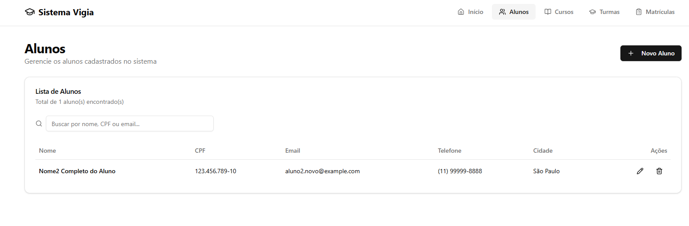
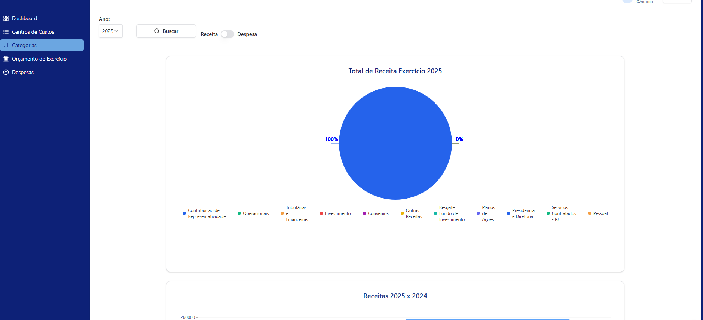

# Olá 👋, eu sou o Theo Ronna

**Desenvolvedor Full‑stack • TypeScript • Next.js • Node • Java • Recharts**

 

## Sobre
Sou o Theo Ronna — desenvolvedor full‑stack focado em dashboards, APIs e ferramentas de segurança. Aqui você encontra meus projetos em destaque, a stack que uso com mais frequência e formas rápidas de contato. Clique nos repositórios fixados para ver código, demos e instruções para rodar localmente.

## Tech stack
**Front‑end:** TypeScript • React • Next.js • Tailwind CSS  
**Back‑end:** Node.js • Express • Prisma • PostgreSQL • Java • Spring Boot  
**Infra / DevOps:** Docker • GitHub Actions • Vercel

## Projetos em destaque
- [vigia-frontend](https://github.com/theoronna88/vigia-frontend) — **CRM para escola de formação de vigilantes (frontend).** (Next.js • React • Postgres/MySQL)  
  

- [vigia-backend](https://github.com/theoronna88/vigia-backend) — **Backend (Java Spring Boot • Postgres/MySQL).**  
  

- [security-hub](https://github.com/theoronna88/security-hub) — **API para centralizar regras de segurança e permitir a operação remota dos controles de acesso** (ex.: liberação de portas). (Node • Express • Prisma)  
  

- [dashboard-financeiro](https://github.com/theoronna88/dashboard-financeiro) — **Painel financeiro com visualizações interativas** — integração COMSEFAZ / Conta Azul. (React • Recharts)  
  

---

# Hello 👋, I'm Theo Ronna

**Full‑stack Developer • TypeScript • Next.js • Node • Java • Recharts**

 

## About
I'm Theo Ronna — a full‑stack developer focused on dashboards, APIs and security tooling. Below are my featured projects, the tech stack I use most, and quick ways to contact me. Click the pinned repositories to see code, demos and run instructions.

## Tech stack
**Front‑end:** TypeScript • React • Next.js • Tailwind CSS  
**Back‑end:** Node.js • Express • Prisma • PostgreSQL • Java • Spring Boot  
**Infra / DevOps:** Docker • GitHub Actions • Vercel

## Featured projects
- [vigia-frontend](https://github.com/theoronna88/vigia-frontend) — **CRM for security guard training school (frontend).** (Next.js • React • Postgres/MySQL)  
  

- [vigia-backend](https://github.com/theoronna88/vigia-backend) — **Backend (Java Spring Boot • Postgres/MySQL).**  
  

- [security-hub](https://github.com/theoronna88/security-hub) — **API to centralize security rules and enable remote operation of access-control systems** (e.g., door release). (Node • Express • Prisma)  
  

- [dashboard-financeiro](https://github.com/theoronna88/dashboard-financeiro) — **Financial dashboard with interactive visualizations** — COMSEFAZ / Conta Azul integration. (React • Recharts)  
  

## Stats

---

Open to freelance and full‑time roles — contact: [theo@ronna.com.br](mailto:theo@ronna.com.br) • https://www.linkedin.com/in/theoronna

---
